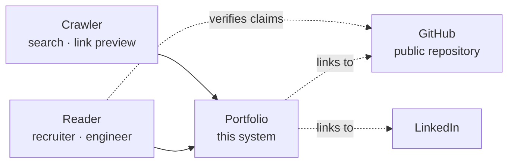
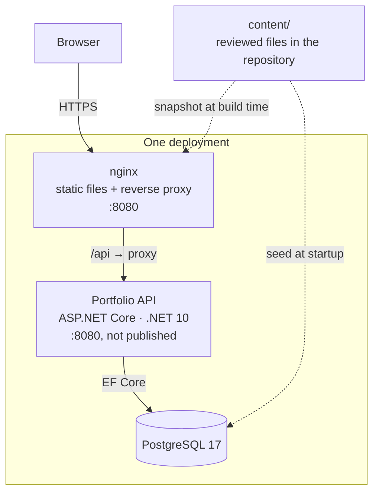
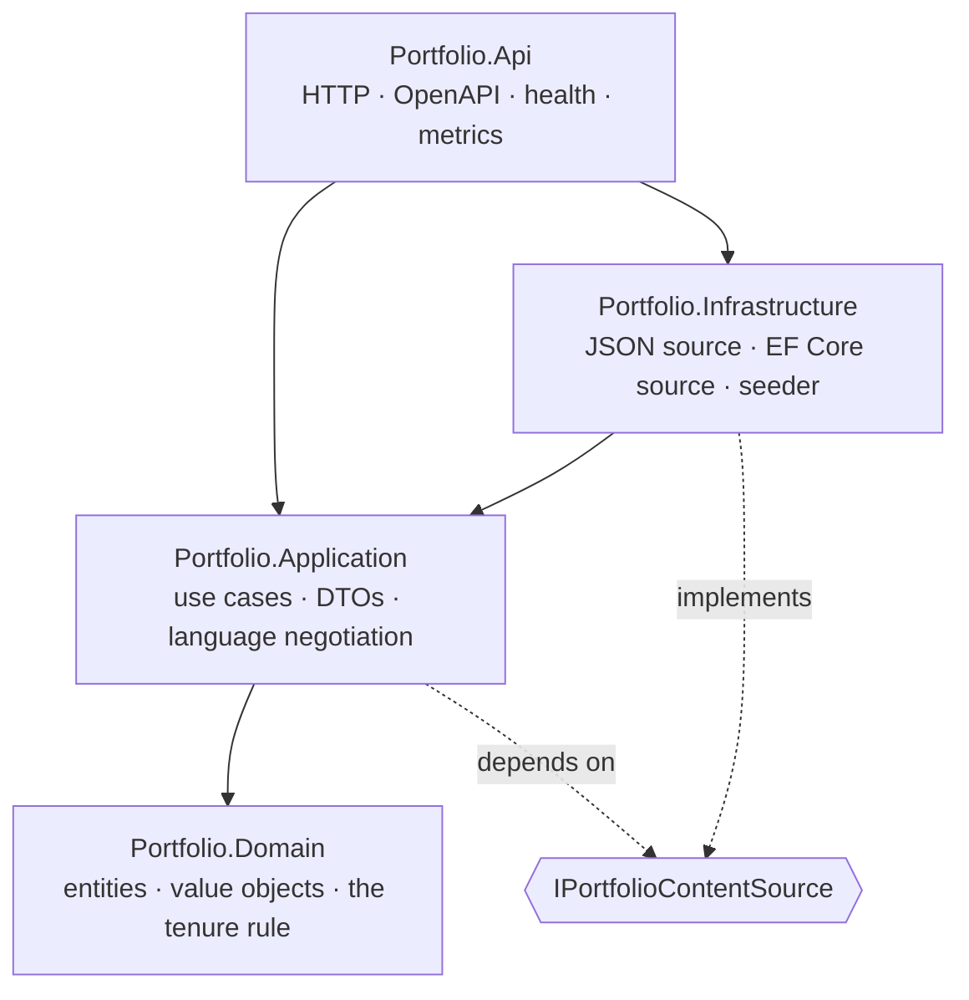
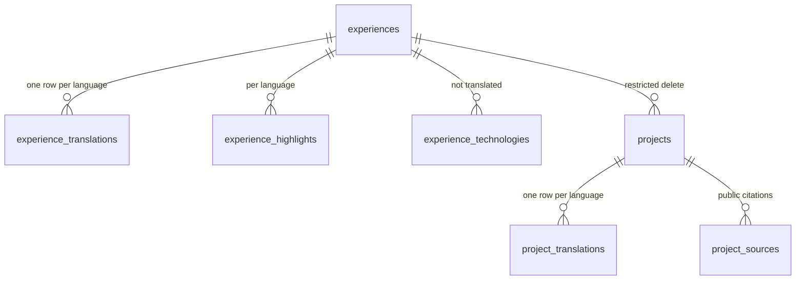
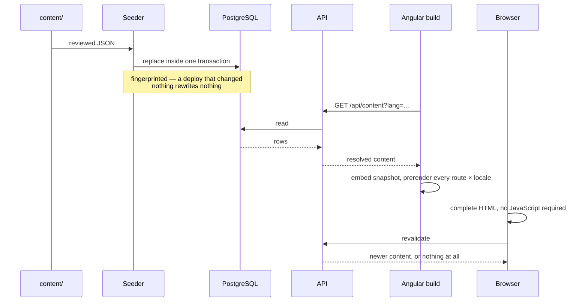
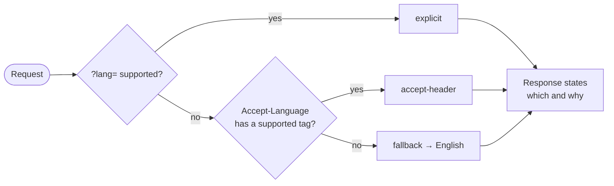

# Architecture

How the system is put together, and why each part is the size it is.

The short version: a prerendered Angular frontend, an ASP.NET Core API, and PostgreSQL. Every layer
is small on purpose. The goal was a complete flow that holds together — data model, application
layer, HTTP contract, client, deployment — not a large system that impresses by size.

Decisions are recorded individually in [`adr/`](adr/); this document is the map that ties them
together.

---

## 1. Context

The system has no users in the software sense: nobody signs in, nothing is submitted, no state is
kept per visitor. That single fact removes authentication, sessions, CSRF, account recovery and
most of what a "real application" usually spends its complexity on — and it is why the complexity
that remains had to be justified rather than assumed.

## 2. Containers

**nginx** serves prerendered HTML — one file per route and locale — and proxies `/api`. There is no
application server on that side: the output is files.

**The API** is stateless and read-only. It is not published to the host and is reachable only
through nginx, so the browser sees a single origin and CORS never enters the picture.

**PostgreSQL** holds the content, seeded from the reviewed files in the repository.

**`content/`** is the source of truth for everything professional. It feeds the database seed, the
build-time snapshot the frontend embeds, and the generated CV. One copy, three consumers.

## 3. Inside the API

Clean Architecture, kept pragmatic — [ADR-0004](adr/0004-backend-architecture.md).

The domain has no framework references, which is why its rules test in milliseconds. The one real
business rule lives there: **years of experience are the union of the months every role covers**,
divided by twelve. Summing role durations would inflate the 2022 freelance overlap; measuring first
start to last end would count a career gap as experience. Both are tested, including one test pinned
to the real career so the site and the CV cannot drift apart.

`IPortfolioContentSource` is the only seam between the application and its storage. Not a repository
per entity, not a generic repository — one interface returning the whole resolved content for one
language, because that is the only shape the application ever asks for. Two implementations exist,
and which one runs is configuration.

## 4. Bilingual content

Facts live on the base tables. Translated text lives in `*_translations`, keyed by
`(entity_id, language_code)`, so **a third language is a data change rather than a migration** —
[ADR-0001](adr/0001-bilingual-content.md).

Translations are stored **resolved**: one complete row per language, with the fallback between a
translation and the base locale decided once, at seed time. A read is then a straight filter on
`language_code`, and the database cannot serve a half-translated record.

Check constraints refuse a period that ends before it starts and a month outside 1–12. A negative
duration would render as nonsense on a public page, so the storage refuses it even if something
upstream tries.

## 5. How content reaches a reader

The inversion in the last two steps is the whole of
[ADR-0002](adr/0002-frontend-rendering.md). The snapshot is **imported**, not fetched, so
prerendering is deterministic and offline. In the browser the app revalidates and swaps in anything
newer.

The consequence that matters: **there is no loading state and no error state for content anywhere in
this application.** If the API is unreachable, cold-starting or simply slow, the page is complete and
a discreet line says the content is cached. A portfolio that shows a spinner or an error while
someone reads it during an interview has failed at the only moment that counted.

## 6. Language resolution

Quality values are honoured and regional tags reduce to their base language. A malformed header
falls back rather than failing: a broken header from some client is not a reason to refuse a public
page.

Every response reports which language it resolved and from where, so a caller never has to guess.

On the frontend, the locale is decided by the **URL and nothing else** — no `Accept-Language`
redirect, because guessing destabilises the canonical URLs that prerendering depends on and takes
the choice away from the reader. The one exception is the bare `/`, where there is nothing else to
go on.

## 7. Operations

| | |
|---|---|
| Liveness | `/health/live`, runs no checks at all. It answers whether the process is wedged; a content or database problem must not make an orchestrator restart a healthy process. |
| Readiness | `/health/ready`, loads content in **every** supported language — catching the case where English works and Spanish does not, a failure only Spanish-speaking visitors would otherwise see. |
| Logging | One structured line per request: method, **route template**, status, duration, correlation id. The template, so a thousand requests for different projects aggregate into one series instead of a thousand. |
| Metrics | `/metrics` in Prometheus format, instrumented with the standard .NET metrics API so an OpenTelemetry collector can consume it later unchanged. Not proxied by nginx. |
| Errors | RFC 7807 problem documents from one handler. Only exceptions the application defines contribute their message. |
| Limits | A fixed window per caller, never applied to health or metrics. |

Security posture, and what it deliberately does not cover: [security.md](security.md).

## 8. What is deliberately absent

- **No microservices.** One bounded context, one deployable. Splitting it would demonstrate the
  word rather than the judgement, and the development plan says the same thing.
- **No CQRS, no mediator.** One handler class per read of a read-only site is ceremony with no
  payoff.
- **No generic repository.** It would exist to hide EF Core behind an abstraction nothing needs.
- **No third-party logging library.** The framework already writes structured JSON to stdout, which
  is what every container platform collects.
- **No OpenTelemetry exporter.** There is nowhere to export to. The instrumentation is already the
  API an exporter would read, so adding one later changes nothing here.
- **No authentication.** Every endpoint serves content that is already public.

Each of these is a decision with a cost, not an omission. The costs are written down in the ADRs and
repeated on the site's own [engineering page](../src/frontend/portfolio-web/README.md).

## 9. Questions this design should be able to answer

The original plan lists the questions an interviewer would ask. Short answers, with where the long
one lives:

| Question | Answer |
|---|---|
| Why a database at all? | It is not needed for ten static pages — which is exactly why building it without one would have said nothing about the work. §1 above. |
| What if the API stops responding? | The page still renders from the embedded snapshot; only a discreet cached-content notice appears. Tested by stopping the API in CI. |
| What if there are two replicas? | The API is stateless and its content is read-only, so replicas are interchangeable. Migration on startup is the part that stops being safe, and it is documented as the thing to change first if a second replica ever exists. |
| What if PostgreSQL fails? | Readiness turns red and the API returns errors; the site keeps serving prerendered content. Real high availability for a portfolio's database would be cost without benefit. |
| How does a new version deploy? | CI builds and tests; images are built per commit. The deployment target is decided in phase 11 and wired in phase 13. |
| How do you know the two content sources agree? | They are compared, in a script and in a test, on every push. It has already caught a real disagreement. |

## 10. Diagrams

The diagrams above are Mermaid, rendered by GitHub, and live in this file rather than as separate
image files so they cannot drift from the text they illustrate. The site's own engineering page
carries hand-written inline SVG versions of the architecture, the flows and the data model — see
[`src/frontend/portfolio-web/src/app/diagrams/`](../src/frontend/portfolio-web/src/app/diagrams/).
